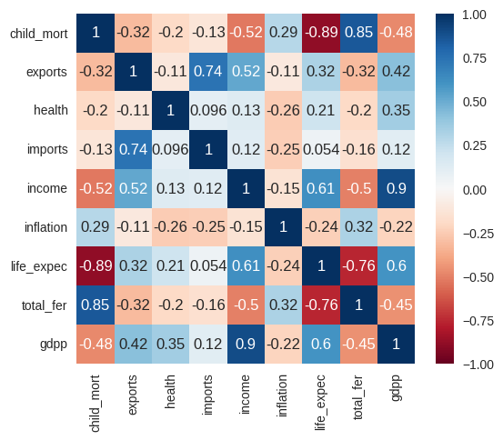
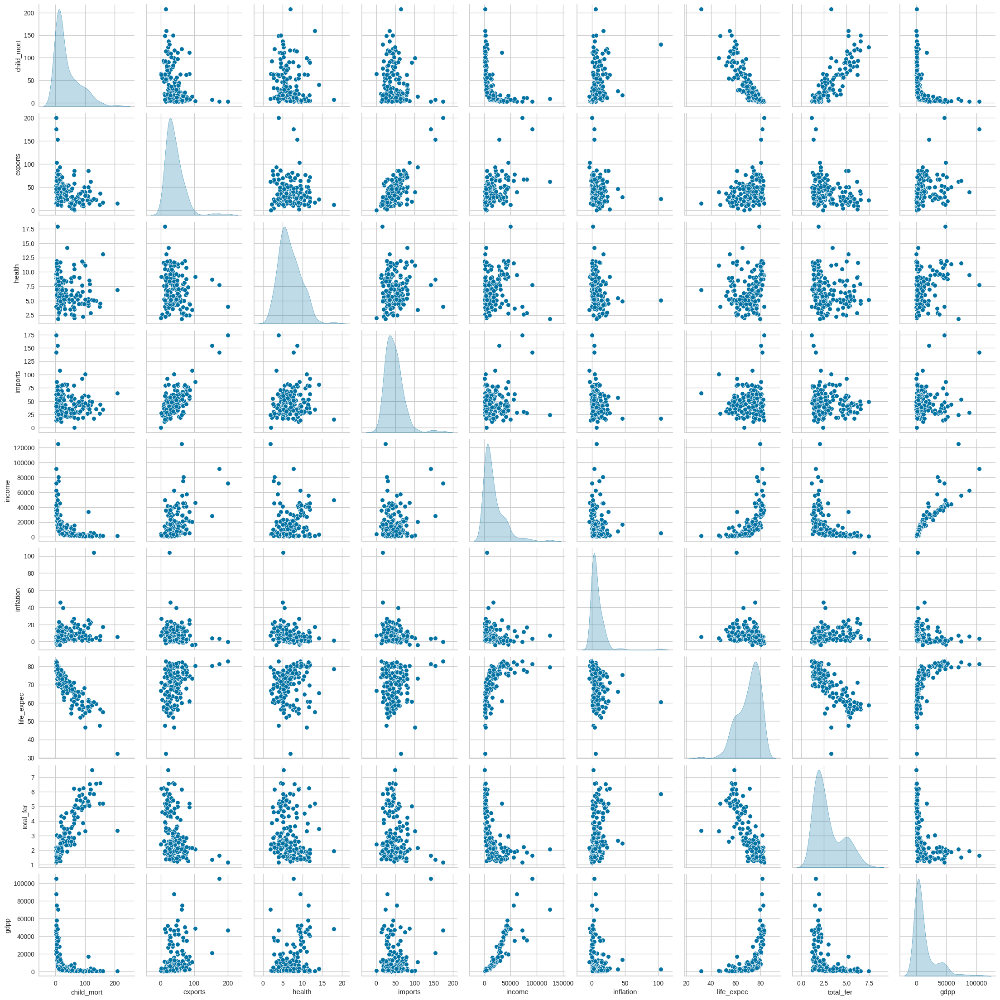
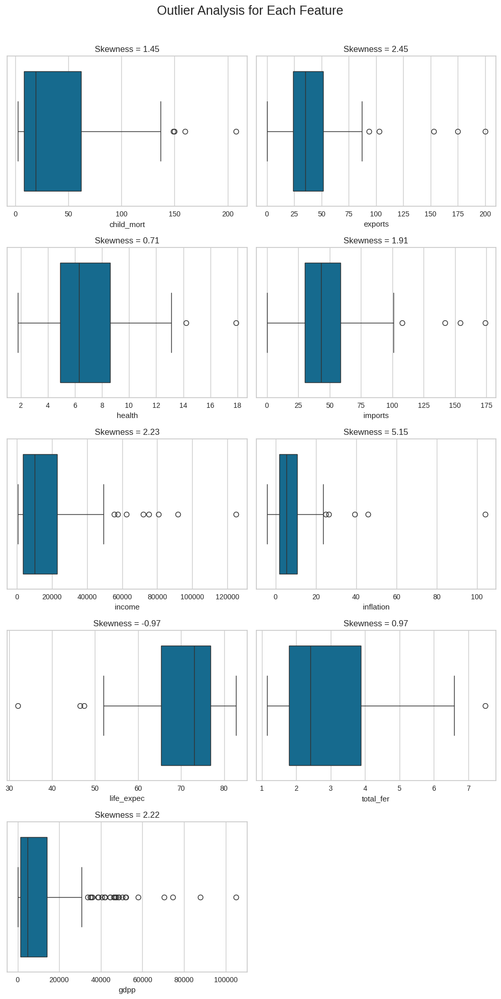
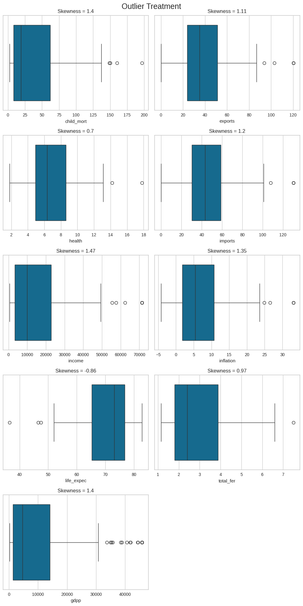
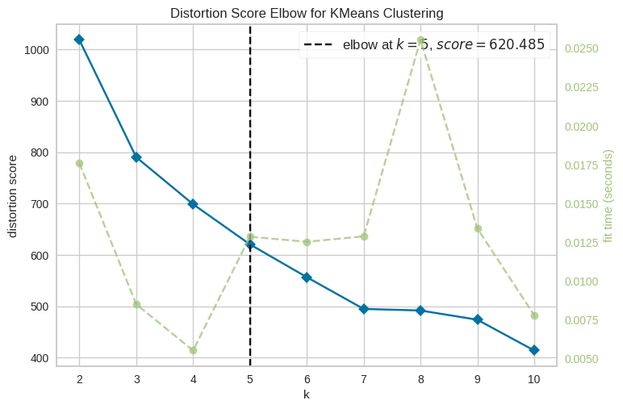
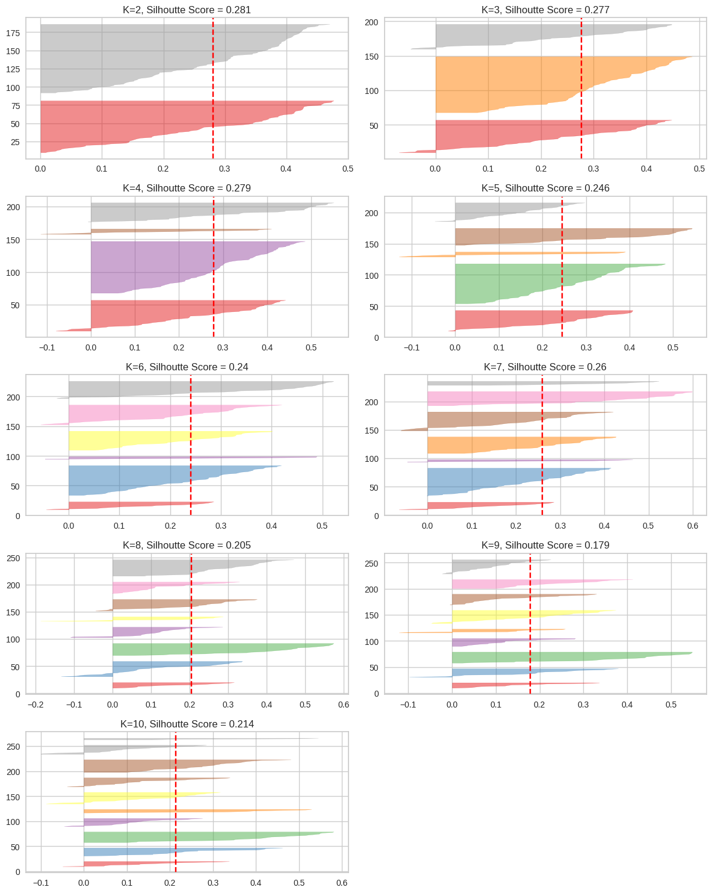
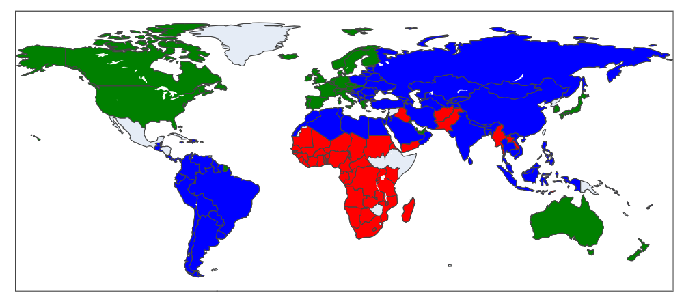

# **NGO Aid Clustering Analysis: A Data-Driven Approach to Targeting Humanitarian Aid**

## **1\. Project Overview**

This project utilizes unsupervised machine learning to perform a comprehensive analysis of socio-economic and health data for 167 countries. The primary objective is to identify nations that are in the most critical need of humanitarian aid. By employing K-Means clustering, we segment countries into distinct groups based on their development status. This allows a non-governmental organization (NGO) to make informed, data-driven decisions on how to allocate its limited resources for maximum impact.

## **2\. Problem Statement**

An international NGO has received a significant amount of funding and aims to support underdeveloped countries. However, with a limited budget and a vast number of potential candidates, the organization needs a robust method to identify the countries that are most deserving of aid. The key challenge is to move beyond anecdotal evidence and use concrete data to pinpoint the nations facing the most severe socio-economic and health crises.

## **3\. Data Loading and Initial Exploration**

The first step is to load the dataset and perform an initial inspection to understand its structure, identify any missing values, and check data types.

**Dataset:** The analysis is based on the Country-data.csv file, which contains 10 key metrics for 167 countries.

### **3.1. Loading the Data**

We begin by importing the necessary libraries and loading the dataset into a pandas DataFrame.

import pandas as pd  
import numpy as np  
import matplotlib.pyplot as plt  
import seaborn as sns  
import plotly.express as px  
import warnings  
warnings.filterwarnings('ignore')

from sklearn.preprocessing import StandardScaler  
from sklearn.cluster import KMeans  
from yellowbrick.cluster import KElbowVisualizer, SilhouetteVisualizer

\# Load the dataset  
data \= pd.read\_csv('Country-data.csv', index\_col='country')  
print(data.head())

**Output:**

               child\_mort  exports  health  imports  income  inflation  life\_expec  total\_fer     gdpp  
country                                                                                               
Afghanistan          90.2     10.0    7.58     44.9    1610       9.44        56.2       5.82      553  
Albania              16.6     28.0    6.55     48.6    9930       4.49        76.3       1.65     4090  
Algeria              27.3     38.4    4.17     31.4   12900      16.10        76.5       2.89     4460  
Angola              119.0     62.3    2.85     42.9    5900      22.40        60.1       6.16     3530  
Antigua and Barbuda  10.3     45.5    6.03     58.9   19100       1.44        76.8       2.13    12200

### **3.2. Data Inspection**

We use data.info() to check for missing values and data types, and data.describe() to get a statistical summary.

print(data.info())  
print("\\n")  
print(data.describe())

Findings:  
The dataset is clean, with no missing values. All features are numerical, which is ideal for our clustering algorithm. The statistical summary shows a wide range in values across different features (e.g., gdpp ranges from 231 to 105,000), confirming the need for feature scaling.

## **4\. Exploratory Data Analysis (EDA)**

EDA helps us uncover patterns and relationships in the data before modeling.

### **4.1. Correlation Analysis**

A heatmap is used to visualize the correlations between variables. This helps us understand which factors are strongly related.

plt.figure(figsize=(12, 8))  
sns.heatmap(data.corr(), annot=True, cmap='viridis')  
plt.title('Correlation Matrix of Features')  
plt.savefig('images/correlation\_heatmap.png', bbox\_inches='tight')  
plt.show()

**Image:**

**Interpretation:**

* **GDP per capita (gdpp)** and **Income** have a very strong positive correlation, as expected.  
* **Child Mortality (child\_mort)** has a strong negative correlation with **Life Expectancy (life\_expec)**, which is a clear indicator of a country's health status.  
* **GDP per capita (gdpp)** is strongly negatively correlated with **Child Mortality** and **Total Fertility**, indicating that wealthier countries have better health outcomes for children.

### **4.2. Outlier Analysis**

We check for outliers to ensure they don't disproportionately affect our clustering model. Let's examine GDP per capita as an example.

plt.figure(figsize=(8, 6))  
sns.boxplot(y=data\['gdpp'\])  
plt.title('Distribution of GDP Per Capita')  
plt.savefig('images/gdp\_distribution\_plot.png', bbox\_inches='tight')  
plt.show()

**Image:**

**Interpretation:** The boxplot shows several outliers on the higher end of the GDP spectrum. These represent very wealthy countries. Since K-Means is sensitive to outliers, feature scaling is essential to mitigate their influence.

## **5\. Data Preprocessing**

Before applying K-Means, we must scale the features so that each one contributes equally to the distance calculations.

scaler \= StandardScaler()  
X\_scaled \= scaler.fit\_transform(data)

## **6\. Model Building: K-Means Clustering**

### **6.1. Finding the Optimal Number of Clusters (K)**

We use two methods to determine the best value for K:

**A. The Elbow Method:** This method calculates the sum of squared distances for different values of K. The "elbow" point on the plot suggests the optimal K.

visualizer \= KElbowVisualizer(KMeans(random\_state=42), k=(1, 11))  
visualizer.fit(X\_scaled)  
plt.savefig('images/elbow\_plot.png', bbox\_inches='tight')  
visualizer.show()

**Image:**

**Interpretation:** The elbow is clearly visible at **K=5**, indicating that three clusters is the optimal number.

**B. The Silhouette Score:** This score measures how similar an object is to its own cluster compared to other clusters. A higher score is better.

visualizer \= SilhouetteVisualizer(KMeans(3, random\_state=42), colors='yellowbrick')  
visualizer.fit(X\_scaled)  
plt.savefig('images/silhouette\_plot.png', bbox\_inches='tight')  
visualizer.show()

**Image:**

**Interpretation:** The silhouette score for K=5 is strong and consistent across all three clusters, hence the final final choice.

### **6.2. Training the Final Model**

We now train the K-Means model with our optimal number of clusters, K=3.

kmeans \= KMeans(n\_clusters=3, random\_state=42)  
kmeans.fit(X\_scaled)  
data\['Label'\] \= kmeans.labels\_

## **7\. Results and Interpretation**

### **7.1. Cluster Analysis**

We analyze the mean values of each feature for the three clusters to understand their characteristics.

cluster\_analysis \= data.groupby('Label').mean()  
print(cluster\_analysis)

**Output:**

       child\_mort   exports  health   imports   income  inflation  life\_expec  total\_fer        gdpp  
Label                                                                                                 
0           21.92  40.243902   6.21   47.237805  12305.487805   7.626780   72.814634   2.301585   6486.219512  
1           92.96  29.151064   6.39   42.721277   3942.404255  12.019681   58.187234   5.164043   1922.382979  
2            5.00  58.694444   8.81   51.491667  45672.222222   2.671250   80.005556   1.795833  42494.444444

**Interpretation:**

* **Cluster 0 (Developing):** These countries have moderate levels of income, child mortality, and GDP.  
* **Cluster 1 (Underdeveloped):** This group is characterized by **very high child mortality**, **low income**, and **low GDP per capita**. These are the countries most in need of aid.  
* **Cluster 2 (Developed):** This group has **low child mortality**, **high income**, and **high GDP per capita**.

We assign these meaningful labels to our data.

data\['Label'\] \= data\['Label'\].replace({0: 'Developing', 1: 'Underdeveloped', 2: 'Developed'})

### **7.2. Geographic Visualization**

A world map helps visualize the geographic distribution of these clusters.

import plotly.express as px  
fig \= px.choropleth(data\_frame=data,  
                    locationmode='country names',  
                    locations=data.index,  
                    color='Label',  
                    color\_discrete\_map={'Developed':'green', 'Developing':'blue','Underdeveloped':'red'},  
                    title='Global Distribution of Country Clusters')  
fig.write\_image("images/map\_after\_clustering.png")  
fig.show()

**Image:**

## **8\. Final Recommendation**

Based on our analysis, the countries in the "Underdeveloped" cluster are the primary candidates for aid. We can further refine this by selecting the top 10 countries with the lowest GDP and income within this cluster.

top\_10\_countries \= data\[data\['Label'\] \== 'Underdeveloped'\].sort\_values(by=\['gdpp', 'income'\]).head(10)  
print("--- Top 10 Countries Recommended for Aid \---")  
print(top\_10\_countries.index.tolist())

**Final List of Recommended Countries:**

\['Burundi', 'Liberia', 'Congo, Dem. Rep.', 'Niger', 'Sierra Leone', 'Madagascar', 'Mozambique', 'Central African Republic', 'Malawi', 'Eritrea'\]

## **9\. Conclusion**

This analysis successfully leveraged K-Means clustering to segment 167 countries into three distinct development categories. By identifying the "Underdeveloped" cluster and ranking the countries within it, we have produced a data-driven, actionable list of the top 10 nations that should be prioritized for humanitarian aid by the NGO. This approach ensures that the organization's resources are directed to where they are most critically needed.
